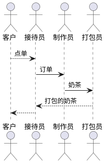
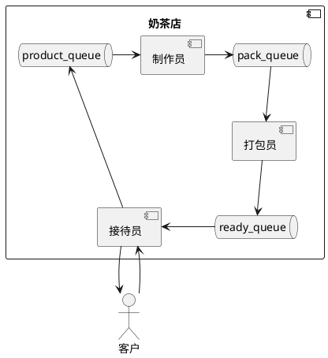
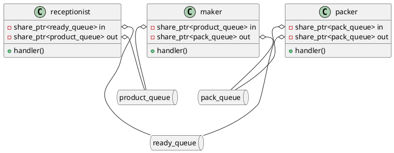
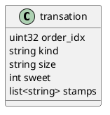

# 买奶茶

奶茶店买一杯奶茶涉及到的步骤有


- 客户到接待员处点奶茶
- 接待员打单打印单据并收银
- 操作员制作奶茶并专递给打包员
- 打包员完成打包，把奶茶给接待员
- 接待员把奶茶给客户

假设一枚奶茶的打单时间是1s，奶茶制作时间是8s，打包时间为2s
receptionist







```
#define DRINK_SHOP_PROTO_CMD_VERSION 1
#define DRINK_SHOP_PROTO_CMD_ORDER   2

struct drink_shop_protocol{
	uint32_t magic;
	int command;
    int result;
	uint32_t payload_length;
	char payload[0];
}

对于version命令的请求，无payload
相应payload为，"{"version":"xxxx"}"

对于order命令的请求，payload为奶茶的参数
{
    "kind":"xxx",
    "size":"big/middle",
    "sweet": 1-3,
}

对于order命令的相应，payload设定为
{
    "order_idx":203，
    "kind":"xxx",
    "size":"big/middle",
    "sweet": 1-3,
    "stamps":[
        "receptionist@hh:mm::ss",
        "maker@hh:mm::ss",
        "packer@hh:mm::ss",
    ]
}

```

